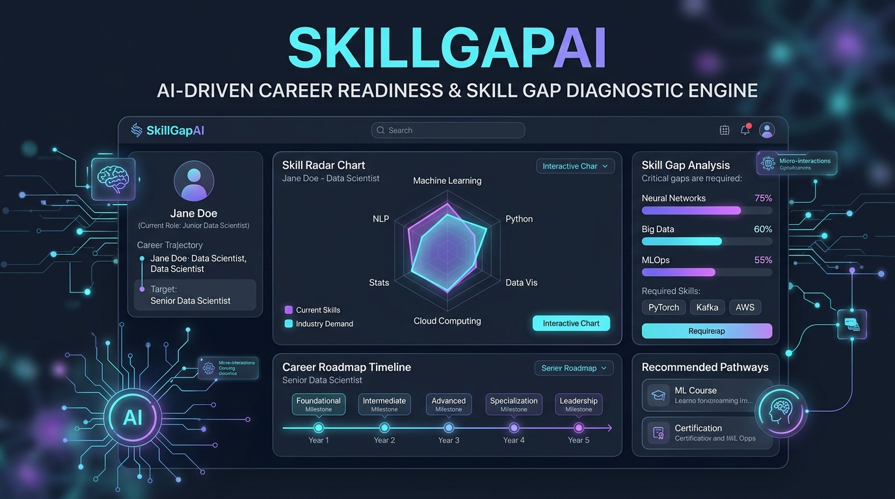
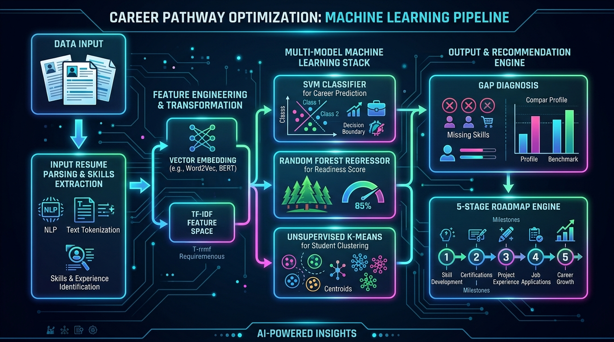
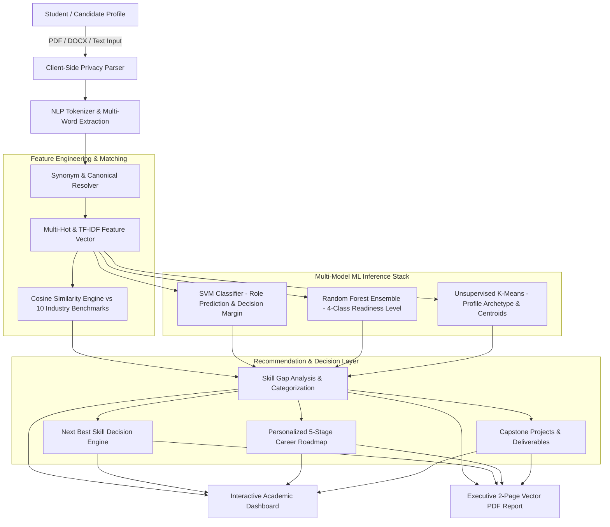
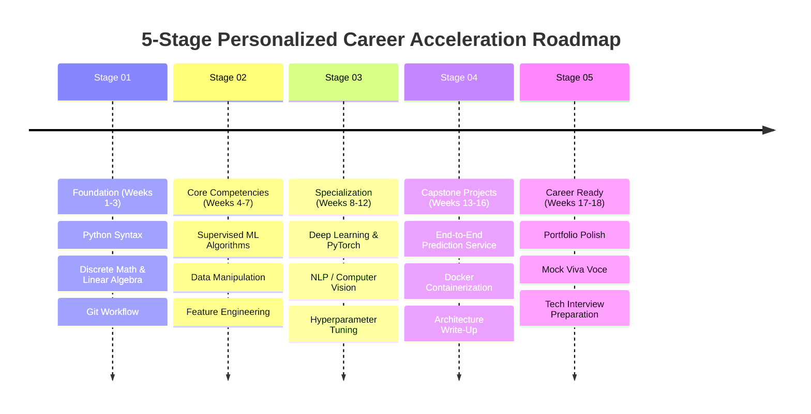

# SkillGapAI — AI-Driven Career Readiness & Skill Gap Diagnostic Engine

<p align="center">
  
</p>

<p align="center">
  <strong>Know Your Gap. Build Your Future.</strong><br>
  <em>An End-to-End Applied Machine Learning Diagnostic & Career Intelligence Platform for Engineering Students and Industry Aspirants.</em>
</p>

<p align="center">
  <a href="#-architecture--pipeline-flow"></a>
  <a href="#-machine-learning-stack"></a>
  <a href="#-executive-pdf-reports"></a>
  <a href="#-quick-start"></a>
</p>

---

## 📌 Table of Contents
1. [Overview & Project Vision](#-overview--project-vision)
2. [Architecture & Pipeline Flow](#-architecture--pipeline-flow)
3. [Key Capabilities & Modules](#-key-capabilities--modules)
4. [Machine Learning Stack & Mathematical Benchmarks](#-machine-learning-stack--mathematical-benchmarks)
5. [Skill Gap Analysis & Requirement Categorization](#-skill-gap-analysis--requirement-categorization)
6. [Personalized 5-Stage Learning Roadmap & Capstones](#-personalized-5-stage-learning-roadmap--capstones)
7. [Executive 2-Page Vector PDF Report](#-executive-2-page-vector-pdf-report)
8. [Quick Start & Installation](#-quick-start--installation)
9. [Project Directory Layout](#-project-directory-layout)
10. [Academic Viva Voce Q&A Reference](#-academic-viva-voce-qa-reference)
11. [Authors & Acknowledgments](#-authors--acknowledgments)

---

## 🎯 Overview & Project Vision

In traditional career counseling and campus placement training, engineering students face a critical blindspot: **they do not know the exact mathematical distance between their current technical profile and industry hiring benchmarks.**

**SkillGapAI** solves this challenge through a multi-model Machine Learning engine that ingests resumes, extracts technical proficiencies with synonym resolution, evaluates deterministic cosine match against 10 target tech tracks, executes calibrated ML predictions, and provides a clear **Skill Gap Analysis & Requirement Categorization** along with an automated **2-Page Executive Downloadable PDF Report**.

```
Resume / Profile Input ➔ NLP Extraction ➔ Cosine Vector Match ➔ Multi-Model ML Ensemble ➔ Gap Diagnosis ➔ 5-Stage Roadmap ➔ Executive PDF
```

---

## 🏗️ Architecture & Pipeline Flow

<p align="center">
  
</p>

The platform is architected around a layered, decoupled intelligence pipeline:



---

## 🌟 Key Capabilities & Modules

### 1. In-Browser Privacy-Preserving Parser
- Zero third-party cloud data transmission; files are processed locally.
- Ingests **PDF, DOCX, and TXT** documents, parsing resume text, experience timestamps, degrees, and project descriptions.
- Auto-extracts verified skills with real-time word boundary matching (`\b`).

### 2. Verified Pre-Loaded Student Presets
- Instant 1-click evaluation with 3 calibrated industry candidate profiles:
  - **Aarav Sharma**: AI/ML Engineer Track (B.Tech CSE, 2.0 Yrs Exp, Python, SQL, Pandas, NumPy, Machine Learning, Git).
  - **Priya Patel**: Data Analyst Track (B.Tech IT, 1.0 Yr Exp, Excel, SQL, Python, Pandas, Statistics, Git).
  - **Rohan Verma**: Software Developer Track (B.E. CSE, 1.5 Yrs Exp, DSA, OOP, Java, SQL, Git).

### 3. Multi-Metric Executive Dashboard
- **Career Readiness Score (%)**: Composite 100-point index calculated from skill coverage, experience weighting, projects, and certifications.
- **Skill Match (Cosine Similarity)**: High-dimensional angle between user competency vector and role requirement vector.
- **Support Vector Machine (SVM) Role Fit**: Prediction across 10 career trajectories with confidence probability and secondary alternatives.
- **K-Means Profile Archetype**: Unsupervised cluster assigning learners to meaningful career peer personas.

---

## 🧠 Machine Learning Stack & Mathematical Benchmarks

| Component | Algorithm / Technique | Primary Objective | Key Metric / Formulation |
| :--- | :--- | :--- | :--- |
| **Skill Match** | Cosine Similarity | Vector angle distance between candidate and job profile | $\text{Cosine}(\mathbf{u}, \mathbf{r}) = \frac{\mathbf{u} \cdot \mathbf{r}}{\|\mathbf{u}\|_2 \|\mathbf{r}\|_2}$ |
| **Role Classifier** | Support Vector Machine (Linear / RBF) | Multi-class role classification across 10 engineering profiles | Hyperplane margin optimization: $\min \frac{1}{2}\|\mathbf{w}\|^2 + C \sum \xi_i$ |
| **Readiness Level** | Random Forest Regressor & Classifier | 4-Class Readiness estimation (*Beginner*, *Developing*, *Intermediate*, *Job Ready*) | Gini Impurity & Bagged Ensemble averaging across 100 estimators |
| **Peer Clustering** | Unsupervised K-Means ($K=5$) | Identifying natural skill clusters & peer archetypes | Objective: $\sum_{i=1}^{k} \sum_{\mathbf{x} \in S_i} \|\mathbf{x} - \boldsymbol{\mu}_i\|^2$ |
| **Decision Rule** | Highest-Weight Gradient Priority | Deterministic "Next Best Skill" recommendation | Max Information Gain on benchmark role closure |

---

## 📊 Skill Gap Analysis & Requirement Categorization

The skill gap analyzer provides clear, non-generic diagnostics grouped into three clear status columns:

```text
┌────────────────────────────────────────────────────────────────────────────────────────┐
│               SKILL GAP ANALYSIS & REQUIREMENT CATEGORIZATION                          │
├──────────────────────────┬─────────────────────────────┬───────────────────────────────┤
│  🟢 STRONG SKILLS        │  🟡 WEAK / DEVELOPING       │  🔴 MISSING SKILLS            │
│  (Verified Competency)   │  (Needs Depth)              │  (Requirement Categorization) │
├──────────────────────────┼─────────────────────────────┼───────────────────────────────┤
│  ✓ Python [Active]       │  ~ SQL [Medium Priority]    │  - PyTorch [CORE • High]      │
│  ✓ Machine Learning      │  ~ Pandas [Needs Project]   │  - Docker [CORE • High]       │
│  ✓ Scikit-Learn          │  ~ Git [Needs CI/CD Depth]  │  - MLOps [SUPPORTING • Med]   │
│  ✓ NumPy                 │                             │  - FastAPI [SUPPORTING • Med] │
└──────────────────────────┴─────────────────────────────┴───────────────────────────────┘
```

1. **Strong Skills (Verified)**: Directly present in the user profile and supported by resume experience or project evidence.
2. **Weak / Developing (Needs Depth)**: Skills identified partially or flagged as needing practical capstone depth.
3. **Missing Skills (Requirement Categorization)**:
   - **CORE (High Priority)**: Must-have foundational skills strictly required to clear technical screens.
   - **SUPPORTING (Medium Priority)**: Tooling, deployment, or secondary libraries that amplify profile strength.

---

## 🗺️ Personalized 5-Stage Learning Roadmap & Capstones

SkillGapAI automatically generates a time-estimated, progressive learning pathway:



### Recommended Industry Capstone Deliverables
- **Real-Time Predictive API**: Fast, containerized REST API deploying a trained scikit-learn model with automated swagger docs.
- **Full-Stack ML Dashboard**: Interactive frontend communicating with backend model endpoints with drift monitoring.

---

## 📄 Executive 2-Page Vector PDF Report

SkillGapAI features an in-memory, zero-dependency PDF generation system engineered using `jsPDF`:

- **Page 1: Profile & Diagnostic Intelligence**
  - Modern Slate-900 & Teal brand header with Candidate Name, Degree, and Target Track.
  - Candidate Profile Card displaying grad year, experience, accredited certifications, and logged competencies.
  - 4 Key ML KPI Metric cards (Readiness, Cosine Match, SVM Prediction, and Cluster Archetype).
  - Full **Skill Gap Analysis & Requirement Categorization** 3-column diagnostic grid.
  - High-impact **Next Best Skill Decision Engine** callout.
- **Page 2: Action Plan & Implementation**
  - 5-Stage timeline roadmap with weekly commitments.
  - Industry Capstone projects with specific architectural deliverables.
  - Interactive Action Checklist with completed item counters and tracking state.

---

## ⚡ Quick Start & Installation

### Prerequisites
- Node.js 18.0+ / npm 9.0+
- Python 3.10+ (if running Python backend scripts)

### 1. Clone the Repository
```bash
git clone https://github.com/rshamith777-cpu/Skill-Gap-AI.git
cd Skill-Gap-AI
```

### 2. Frontend Setup (React + Vite + Tailwind CSS)
```bash
# Install NPM dependencies
npm install

# Run Vite development server
npm run dev
```
Navigate to `http://localhost:3000` in your browser.

### 3. Build for Production
```bash
npm run build
```

---

## 📁 Project Directory Layout

```text
Skill-Gap-AI/
├── docs/
│   └── images/
│       ├── hero_banner.png          # High-resolution platform banner
│       └── architecture_flow.png    # ML pipeline architecture diagram
├── src/
│   ├── components/
│   │   ├── Header.tsx               # Navigation, Preset switchers, Report export
│   │   ├── ProfileForm.tsx          # Resume upload, profile inputs, skill tags
│   │   ├── KpiMetrics.tsx           # 4-Metric ML Dashboard Cards
│   │   ├── SkillGapView.tsx         # Skill Gap Analysis & Categorization
│   │   ├── RoadmapTimeline.tsx      # 5-Stage Learning Roadmap
│   │   ├── ProjectsAndResources.tsx # Capstone projects & documentation links
│   │   ├── ModelEvaluationView.tsx  # Confusion matrix & viva metrics
│   │   ├── VivaDocView.tsx          # Comprehensive academic viva voce guide
│   │   └── ReportView.tsx           # In-browser Career Report viewer
│   ├── utils/
│   │   ├── mlEngine.ts              # Cosine similarity, SVM, RF, and K-Means logic
│   │   ├── reportPdf.ts             # 2-Page Executive Vector PDF Generator
│   │   └── parser.ts                # Client-side resume parsing engine
│   ├── App.tsx                      # Main application orchestrator
│   └── index.css                    # Design system styling & typography tokens
├── models/                          # Pretrained Python joblib ML artifacts
├── training/                        # Python model training pipelines
├── package.json                     # Frontend dependencies
├── requirements.txt                 # Python dependencies
└── README.md                        # Project documentation
```

---

## 🎓 Academic Viva Voce Q&A Reference

<details>
<summary><strong>Q1: Why use Cosine Similarity instead of Euclidean Distance for skill matching?</strong></summary>
<p>
Cosine similarity evaluates the <em>angle</em> between the two high-dimensional skill vectors rather than their magnitude. In student resumes, some profiles may list 30 skills while others list 8. Euclidean distance penalizes candidates with varying list lengths; Cosine similarity evaluates directional alignment and thematic overlap, making it scale-invariant.
</p>
</details>

<details>
<summary><strong>Q2: What is the purpose of Support Vector Machines (SVM) in this system?</strong></summary>
<p>
SVM performs supervised multi-class role classification. By computing maximum-margin hyperplanes in high-dimensional TF-IDF skill space, SVM predicts which career path best fits the candidate's existing strengths with high generalization and resistance to overfitting.
</p>
</details>

<details>
<summary><strong>Q3: How does Unsupervised K-Means clustering help the student?</strong></summary>
<p>
K-Means groups the student against 5 empirical peer archetypes (e.g., <em>Data & ML Builder</em>, <em>Backend Systems Specialist</em>, <em>Core Software Developer</em>). This helps academic mentors discover if a student's profile naturally gravitates toward an adjacent specialization.
</p>
</details>

<details>
<summary><strong>Q4: How is the Next Best Skill selected?</strong></summary>
<p>
The Next Best Skill decision engine identifies missing skills classified as <strong>CORE</strong> and selects the one offering the highest marginal increase in role cosine similarity, providing an immediate, actionable priority.
</p>
</details>

---

## 👥 Authors & Acknowledgments

- **Lead Developer & Researcher**: [rshamith777-cpu](https://github.com/rshamith777-cpu)
- **Institution**: 7th Semester B.E. / B.Tech Computer Science & Engineering
- **Domain**: Machine Learning, Natural Language Processing & Educational Data Mining

---

<p align="center">
  <sub>SkillGapAI • Built with Python, Scikit-Learn, React, Vite, and Tailwind CSS.</sub>
</p>
